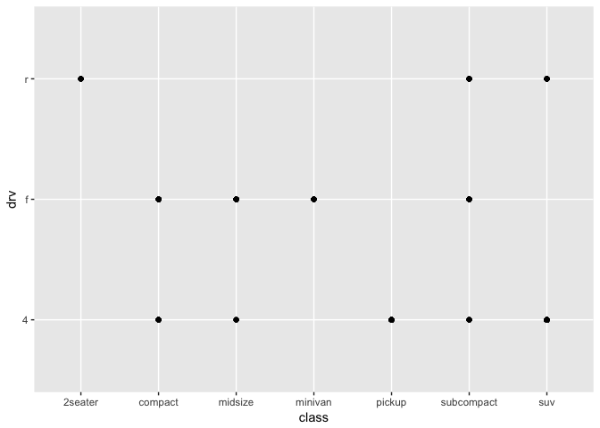
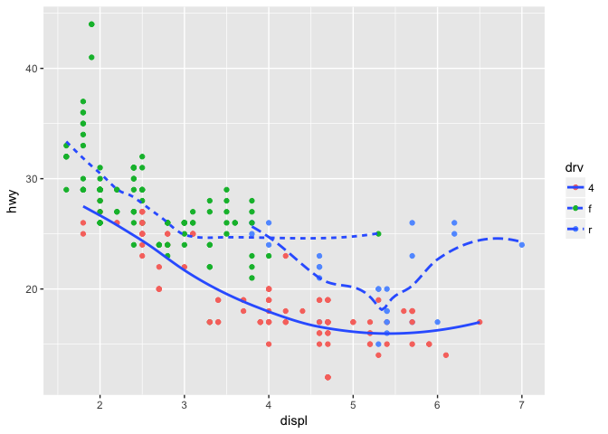
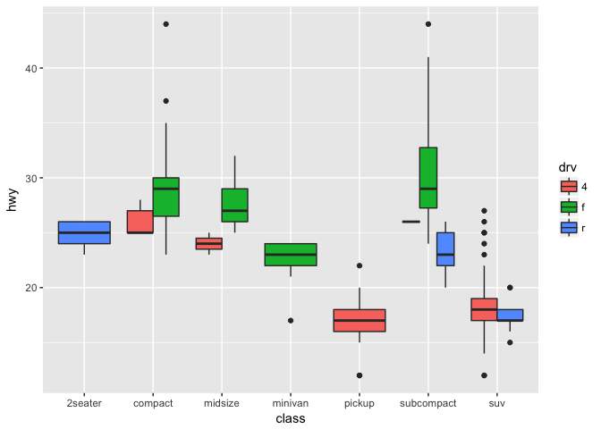

# R4DS-ch3
Ellis Anderson  


```r
library("tidyverse")
```

```
## Warning: package 'tidyverse' was built under R version 3.2.5
```

```
## Loading tidyverse: ggplot2
## Loading tidyverse: tibble
## Loading tidyverse: tidyr
## Loading tidyverse: readr
## Loading tidyverse: purrr
## Loading tidyverse: dplyr
```

```
## Warning: package 'ggplot2' was built under R version 3.2.5
```

```
## Warning: package 'tibble' was built under R version 3.2.5
```

```
## Warning: package 'tidyr' was built under R version 3.2.5
```

```
## Warning: package 'purrr' was built under R version 3.2.5
```

```
## Warning: package 'dplyr' was built under R version 3.2.5
```

```
## Conflicts with tidy packages ----------------------------------------------
```

```
## filter(): dplyr, stats
## lag():    dplyr, stats
```

```r
mpg
```

```
## # A tibble: 234 × 11
##    manufacturer      model displ  year   cyl      trans   drv   cty   hwy
##           <chr>      <chr> <dbl> <int> <int>      <chr> <chr> <int> <int>
## 1          audi         a4   1.8  1999     4   auto(l5)     f    18    29
## 2          audi         a4   1.8  1999     4 manual(m5)     f    21    29
## 3          audi         a4   2.0  2008     4 manual(m6)     f    20    31
## 4          audi         a4   2.0  2008     4   auto(av)     f    21    30
## 5          audi         a4   2.8  1999     6   auto(l5)     f    16    26
## 6          audi         a4   2.8  1999     6 manual(m5)     f    18    26
## 7          audi         a4   3.1  2008     6   auto(av)     f    18    27
## 8          audi a4 quattro   1.8  1999     4 manual(m5)     4    18    26
## 9          audi a4 quattro   1.8  1999     4   auto(l5)     4    16    25
## 10         audi a4 quattro   2.0  2008     4 manual(m6)     4    20    28
## # ... with 224 more rows, and 2 more variables: fl <chr>, class <chr>
```

```r
ggplot(data = mpg) + geom_point(mapping = aes(x=displ, y=hwy))
```

<!-- -->

### Ex 3.2.4

1. 

```r
ggplot(data = mpg)
```

<!-- -->
  big grey box with nothing else
2. 

```r
dim(mtcars)
```

```
## [1] 32 11
```
  32 and 11 respectively
3. 

```r
?mpg
```
  does a car have front, read or 4 wheel drive.
4. 

```r
ggplot(data = mpg) + geom_point(mapping = aes(x=cyl, y=hwy))
```

<!-- -->
5.

```r
ggplot(data = mpg) + geom_point(mapping = aes(x=class, y=drv))
```

<!-- -->
Neither descriptor included in the generation of this plot gives us details on mileage. 
While class has to do with size, we don't know if these classes effect mileage. 
That being said these data do tell us which classes have which kind of drive which is useful for other questions.


```r
ggplot(data = mpg) + geom_point(mapping = aes(x=displ, y=hwy, color=class))
```

<!-- -->

### Ex 3.3.1
1. The color was assigned within the aes brackets.
2. displ, hwy and cty are all continuous while the rest are discrete. Displ may also be discrete as there are a handful of common engine diplacements.
3.

```r
ggplot(data = mpg) + geom_point(mapping = aes(x=displ, y=class, color=cty))
```

<!-- -->

```r
ggplot(data = mpg) + geom_point(mapping = aes(x=displ, y=class, size=cty))
```

<!-- -->
Color behaves continuously as well - i.e. different shades of a color indicate the different value associated with that descriptor.
This is true of shape as well.
Shape won't even let you map a continuous variable to it, which honestly makes a lot of sense. 
4.

```r
ggplot(data = mpg) + geom_point(mapping = aes(x=class, y=cty, color=cty))
```

<!-- -->
Both aesthetics are used. In this case cty scales with the y axis and the shade of a color. 
5.

```r
?geom_point
ggplot(data = mpg) + geom_point(mapping = aes(x=class, y=cty, stroke=(displ/2)))
```

<!-- -->
Stroke alters the border width and therefore requires a numeric value.
6.

```r
ggplot(data = mpg) + geom_point(mapping = aes(x=class, y=cty, color=(displ<5)))
```

<!-- -->
GGplot will use the boolean operator you set up to determine how to display that aesthetic. 
In the code above two colors are used - one for false and one for true.

### Ex 3.5.1

1

```r
plot <- ggplot(data = mpg)
plot <- plot + geom_point(mapping = aes(x=displ, y=class))
plot <- plot + facet_wrap(~cty)
plot
```

<!-- -->
you get a lot of facets from truncating or rounding the continuous variables to make them discrete.

2.

```r
plot1 <- ggplot(data = mpg) + 
  geom_point(mapping = aes(x = displ, y = hwy)) + 
  facet_grid(drv ~ cyl)
plot2 <- ggplot(data = mpg) + 
  geom_point(mapping = aes(x = drv, y = cyl))
plot1
```

<!-- -->

```r
plot2
```

<!-- -->
The empty grids are plots where none of the data intersect. For example there are no 4 wheel drive cars with 5 cylinder engines. these correspond to the vertices of the second plot where no points lie. 

3.

```r
ggplot(data = mpg) + 
  geom_point(mapping = aes(x = displ, y = hwy)) +
  facet_grid(drv ~ .)
```

<!-- -->

```r
ggplot(data = mpg) + 
  geom_point(mapping = aes(x = displ, y = hwy)) +
  facet_grid(. ~ cyl)
```

<!-- -->
The top graph divides the plots on the Y axis whereas the bottom plot divides the plots by the X axis. The '.' sort of acts as a null value for breaking up facet wrap plots. In this way the first ggplot could be read as drv by NULL while the second could be read as NULL by cyl.

4.

```r
ggplot(data = mpg) + 
  geom_point(mapping = aes(x = displ, y = hwy)) + 
  facet_wrap(~ class, nrow = 2)
```

<!-- -->
Faceting the plots allows for better visualization of each class alone - you get a better sense of the distribution of the fuel economies for each class.
Using the color aes gives a better view of the dataset as a whole - how the classes compare and how the distribution of fuel economy varies across the entire spectrum of classes. 
More data means a messier plot if you don't break up the classes.
If you wanted to visualze large data without faceting it you may want to change the alpha value to better visualize density of class values or facet the data.

5.

```r
?facet_wrap
```
  These allow you to define the number of rows and columns used to facet the data.
  Scales allows you to set whether the scale should be fixed or set
  This can also be set to change only x or only y axes.
  You can also add labels, or scale the plot to statistical data (as opposed to raw).
  as.table changes the ordering of plots(highest value either bottom-right or top-right(FALSE)).
  switch can move labels from the top and right to bottom and left respectvely or both.
  You can also change the direction from horizontal(h) or vertical(v) with dir and strip.position lets you set the positioning of labels to top, bottom, left or right
  

```r
?facet_grid
```
  This requires row and column facetting variables and gets its nrow and ncol values from the number of discrete values associated with these variables.
  
6. I'm honestly not super sure and kind of assumed it would be the opposite(more unique values assigned to the row tab) - maybe it's because the y axis starts to get really squished with more values?

### Ex 3.6.1

1. geom_line, geom_boxpot, geom_histogram, and geom_area respectively
2. This shoud produce a scatterplot with a line following the average. there will be no shading for standard error. Drv will be denoted by colors

```r
ggplot(data = mpg, mapping = aes(x = displ, y = hwy, color = drv)) + 
  geom_point() + 
  geom_smooth(se = FALSE)
```

```
## `geom_smooth()` using method = 'loess'
```

<!-- -->
ooooh since, color=drv is a global option there are three lines.
3. 

```r
ggplot(data = mpg, mapping = aes(x = displ, y = hwy, color = drv)) + 
  geom_point(show.legend=FALSE) 
```

<!-- -->
This removes the legend providing a key for the diffent kind of drives and the colors associated. If you remove it the legend is shown. I can't find the exact example using show.legend=FALSE but I'd guess it was used so that we had to predict how the data were split by color.
4. 

```r
?geom_smooth
```
this can be set to either display, or not display the confidence interval surrounding the mean.
5. No, they shouldn't. The first sets x and y as global variables to be inherited by the geoms added later, whereas the second explicitly binds each x and y to each geom. Hoever, they use the same x and y so the two graphs are essentially synonomous. 
6. 

```r
#1
ggplot(data = mpg, mapping = aes(x = displ, y = hwy)) + 
  geom_point() + 
  geom_smooth(se = FALSE)
```

```
## `geom_smooth()` using method = 'loess'
```

<!-- -->

```r
#2
ggplot(data = mpg, mapping = aes(x = displ, y = hwy)) + 
  geom_point() + 
  geom_smooth(se = FALSE, aes(group=drv))
```

```
## `geom_smooth()` using method = 'loess'
```

<!-- -->

```r
#3
ggplot(data = mpg, mapping = aes(x = displ, y = hwy, color=drv)) +
  geom_point() + 
  geom_smooth(se = FALSE)
```

```
## `geom_smooth()` using method = 'loess'
```

<!-- -->

```r
#4
ggplot(data = mpg, mapping = aes(x = displ, y = hwy)) +
  geom_point(aes(color=drv)) + 
  geom_smooth(se = FALSE)
```

```
## `geom_smooth()` using method = 'loess'
```

<!-- -->

```r
#5
ggplot(data = mpg, mapping = aes(x = displ, y = hwy)) +
  geom_point(aes(color=drv)) + 
  geom_smooth(se = FALSE, aes(linetype=drv))
```

```
## `geom_smooth()` using method = 'loess'
```

<!-- -->

```r
#6
ggplot(data = mpg, mapping = aes(x = displ, y = hwy)) +
  geom_point(aes(fill=drv),shape = 21, color = "white", size=2.5, stroke=2.5)
```

<!-- -->

### Ex 3.7.1
1. 

```r
?stat_summary
```
The default geom is geom_pointrange. 

```r
?geom_pointrange

ggplot(data = diamonds) + 
  geom_pointrange(
    mapping = aes(x = cut, y = depth),
    stat = "summary",
    fun.ymin = min,
    fun.ymax = max,
    fun.y = median
  )
```

<!-- -->

2. 

```r
?geom_col
?geom_bar
```
geom_col, unlike geom_bar, does not make the height of a bar proportional to the number of cases in each group.
Instead, the height of bars represent values in the data, i.e. it requires a y value whereas geom_bar does not. 
3.
|Geom|Stat|Stat's Geom|
|---------|---------|---------|
|point    |identity |point    |
|line     |identity |point    |
|bar      |bin      |bar      |
|linerange|identity |point    |
|count    |sum      |point    |
|densty   |density  |area     |
|violin   |ydensity |violin   |
|dotplot  |density  |area     |
|hex      |binhex   |hex      |
4. 

```r
?stat_smooth
```
computes y(predicted value), ymin (lower confidence interval), ymax (upper confidence interval). It also computes the SE by default. method, se, n, span, method.args and formula all alter the output of the stat_smooth.
5. 

```r
ggplot(data = diamonds) + 
  geom_bar(mapping = aes(x = cut, y = ..prop.., group = 20))
```

<!-- -->

```r
ggplot(data = diamonds) + 
  geom_bar(mapping = aes(x = cut, y = ..prop..))
```

<!-- -->

```r
ggplot(data = diamonds) + 
  geom_bar(mapping = aes(x = cut, fill = color, y = ..prop..))
```

<!-- -->

```r
?geom_bar
```
without setting group = 1, group by default includes all x values. therefore all of the groups contain all of the values (it's not grouped by the x values)


### Ex 3.8.1
1. 

```r
ggplot(data = mpg, mapping = aes(x = cty, y = hwy)) + 
  geom_point()
```

<!-- -->
There's a lot of overplotting in the first plot. adding some jitter gives a better idea of where the density lies. 

```r
ggplot(data = mpg, mapping = aes(x = cty, y = hwy)) + 
  geom_point() +
  geom_jitter()
```

<!-- -->
2.
/Library/Frameworks/R.framework/Versions/3.2/Resources/library/ggplot2/help/geom_jitter
height and width affect the amount of vertical and horizontal jitter allowed and defaults to 40% of the resolution.


```r
ggplot(data = mpg, mapping = aes(x = cty, y = hwy)) + 
  geom_point(position = position_jitter(width=.4, height =0))
```

<!-- -->
3.
jitter: stat="identity" and adds a small amount of variation. this is controllable. This seems to be more useful in judging the density of a distribution rather than comparisos(ie, scatter plots with overplotting or discrete intercepts)
count: stat="sum" and counts number of observations at each location. This seems to be more useful for comparative data rather than point data (ie, bar graphs where visual proportions can be seen)
4.

```r
?geom_boxplot
```
- the default position is "dodge".

```r
ggplot(data=mpg, mapping=aes(x=class, y=hwy, fill=drv)) +
  geom_boxplot()
```

<!-- -->

### ex3.9.1

1.

```r
ggplot(data=diamonds, aes(x=factor(1), fill=factor(cut))) +
  geom_bar(width=1) +
  coord_polar(theta="y")
```

<!-- -->
2.

```r
?labs
```
labs() allows you to change labels such as the x, y and title labels.
3.

```r
?coord_quickmap
?coord_map
```
 Map projections do not, in general, preserve straight lines, so this requires considerable computation. coord_quickmap is a quick approximation that does preserve straight lines. It works best for smaller areas closer to the equator.
4.

```r
?coord_fixed
```
this fixes the ratio of x units to y units at 1:1 the ratio can be changed but is not in this example.

```r
?geom_abline
```
this adds a diagonal reference line, in this case starting at x=y=10 and contnuing to x=y=30 and onwards.
These two features help define the visual relationship of cty and hwy on the chart and make it easier to visually analyze.
It also makes it clear that hwy is consistently > mpg.
