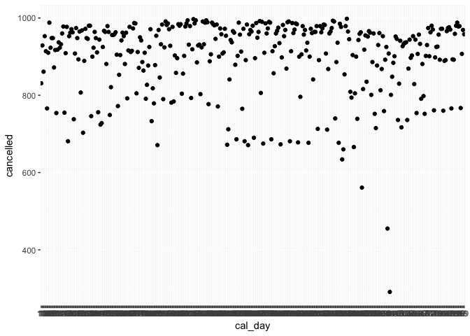
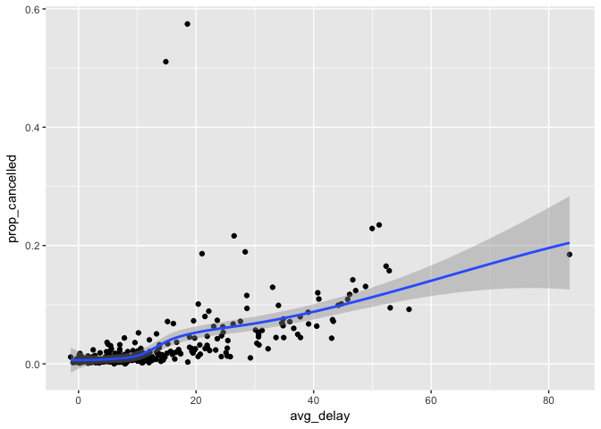
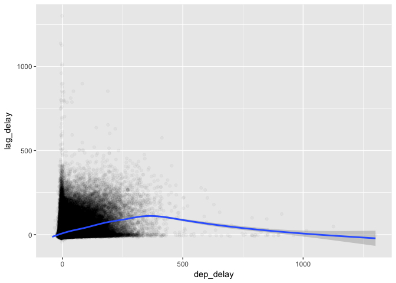

# chapter5_p2

# Chapter 5 Part 2

## Set Up

```r
library(tidyverse)
```

```
## Warning: package 'tidyverse' was built under R version 3.2.5
```

```
## Loading tidyverse: ggplot2
## Loading tidyverse: tibble
## Loading tidyverse: tidyr
## Loading tidyverse: readr
## Loading tidyverse: purrr
## Loading tidyverse: dplyr
```

```
## Warning: package 'ggplot2' was built under R version 3.2.5
```

```
## Warning: package 'tibble' was built under R version 3.2.5
```

```
## Warning: package 'tidyr' was built under R version 3.2.5
```

```
## Warning: package 'purrr' was built under R version 3.2.5
```

```
## Warning: package 'dplyr' was built under R version 3.2.5
```

```
## Conflicts with tidy packages ----------------------------------------------
```

```
## filter(): dplyr, stats
## lag():    dplyr, stats
```

```r
library(nycflights13)

not_cancelled <- flights %>% 
  filter(!is.na(dep_delay), !is.na(arr_delay))
```

## Exercise 5.6
#### Question 1

Not super sure what this question is asking but a delay is more important than arriving early. I might assess the delay characteristics using a point system to establish the reliability of the flight and then also give the average time of arrival based on the probabilities of being early or late. 

As being early is nice I might give that 1 point for every minute, whereas being late would give two negative points per minute. So the first flight would get a score of -15 (.5 \* 15 \* 1) + (.5 \* 15 \* -2) and an average arrival time of on time. 

A better way to determine the reliability score might be to use the standard deviation from the mean. For the first flight that would be sqrt(.5*(15^2+(-15)^2)) or 15 for the first flight, but 0 for the flight that's always 10 minutes late. The larger the score the more variable the flight, whereas a score of 0 means the flight is always at the time given by the average time. 

All this said, the first points score might still be useful as it allows someone to understand whether their flight is more likely to be early or late depending on the score. 

#### Question 2


```r
not_cancelled %>%
  group_by(dest) %>%
  summarise(n = n())
```

```
## # A tibble: 104 × 2
##     dest     n
##    <chr> <int>
## 1    ABQ   254
## 2    ACK   264
## 3    ALB   418
## 4    ANC     8
## 5    ATL 16837
## 6    AUS  2411
## 7    AVL   261
## 8    BDL   412
## 9    BGR   358
## 10   BHM   269
## # ... with 94 more rows
```

```r
not_cancelled %>%
  group_by(tailnum) %>%
  summarise(distance = sum(distance))
```

```
## # A tibble: 4,037 × 2
##    tailnum distance
##      <chr>    <dbl>
## 1   D942DN     3418
## 2   N0EGMQ   239143
## 3   N10156   109664
## 4   N102UW    25722
## 5   N103US    24619
## 6   N104UW    24616
## 7   N10575   139903
## 8   N105UW    23618
## 9   N107US    21677
## 10  N108UW    32070
## # ... with 4,027 more rows
```

#### Question 3

arr_delay is the most important column as flights that are cancelled in air might still have dep_delays.


```r
flights %>%
  filter(!is.na(dep_delay) & is.na(arr_delay))
```

```
## # A tibble: 1,175 × 16
##     year month   day dep_time dep_delay arr_time arr_delay carrier tailnum
##    <int> <int> <int>    <int>     <dbl>    <int>     <dbl>   <chr>   <chr>
## 1   2013     1     1     1525        -5     1934        NA      MQ  N719MQ
## 2   2013     1     1     1528        29     2002        NA      EV  N17108
## 3   2013     1     1     1740        -5     2158        NA      MQ  N739MQ
## 4   2013     1     1     1807        29     2251        NA      UA  N31412
## 5   2013     1     1     1939        59       29        NA      9E  N905XJ
## 6   2013     1     1     1952        22     2358        NA      EV  N11194
## 7   2013     1     1     2016        46       NA        NA      EV  N14168
## 8   2013     1     2      905        43     1313        NA      EV  N15912
## 9   2013     1     2     1125       120     1445        NA      9E  N8783E
## 10  2013     1     2     1848         8     2333        NA      9E  N920XJ
## # ... with 1,165 more rows, and 7 more variables: flight <int>,
## #   origin <chr>, dest <chr>, air_time <dbl>, distance <dbl>, hour <dbl>,
## #   minute <dbl>
```

```r
# this returns a few lines

flights %>%
  filter(is.na(dep_delay) & !is.na(arr_delay))
```

```
## # A tibble: 0 × 16
## # ... with 16 variables: year <int>, month <int>, day <int>,
## #   dep_time <int>, dep_delay <dbl>, arr_time <int>, arr_delay <dbl>,
## #   carrier <chr>, tailnum <chr>, flight <int>, origin <chr>, dest <chr>,
## #   air_time <dbl>, distance <dbl>, hour <dbl>, minute <dbl>
```

```r
# this does not
```

#### Question 4


```r
cancelled_by_day <- flights %>%
  group_by(year, month, day) %>%
  summarise(cancelled = sum(!is.na(arr_delay)))
  
cancelled_by_day$cal_day <- row.names(cancelled_by_day)

ggplot(data = cancelled_by_day, mapping = aes(x = cal_day,
                                              y = cancelled)) +
    geom_point()
```

<!-- -->

```r
flights %>%
  group_by(year, month, day) %>%
  mutate(cancelled = is.na(arr_delay)) %>%
  summarise(prop_cancelled = mean(cancelled),
         avg_delay = mean(dep_delay, na.rm = TRUE)) %>%
  ggplot(mapping = aes(x=avg_delay, y=prop_cancelled)) +
    geom_point() +
    geom_smooth()
```

```
## `geom_smooth()` using method = 'loess'
```

<!-- -->

#### Question 5

So I worked really hard on this before I accidentally deleted all my homework so I kinda already know the answer - while you can try and disenttangle the effects of bad airports, it turns out even when you remove bad airports the airline avg delays don't change much.


```r
flights %>%
  group_by(carrier) %>%
  summarise(avg_delay = mean(arr_delay, na.rm = TRUE)) %>%
  arrange(desc(avg_delay))
```

```
## # A tibble: 16 × 2
##    carrier  avg_delay
##      <chr>      <dbl>
## 1       F9 21.9207048
## 2       FL 20.1159055
## 3       EV 15.7964311
## 4       YV 15.5569853
## 5       OO 11.9310345
## 6       MQ 10.7747334
## 7       WN  9.6491199
## 8       B6  9.4579733
## 9       9E  7.3796692
## 10      UA  3.5580111
## 11      US  2.1295951
## 12      VX  1.7644644
## 13      DL  1.6443409
## 14      AA  0.3642909
## 15      HA -6.9152047
## 16      AS -9.9308886
```

#### Question 6


```r
not_cancelled %>% count(dest, sort=TRUE)
```

```
## # A tibble: 104 × 2
##     dest     n
##    <chr> <int>
## 1    ATL 16837
## 2    ORD 16566
## 3    LAX 16026
## 4    BOS 15022
## 5    MCO 13967
## 6    CLT 13674
## 7    SFO 13173
## 8    FLL 11897
## 9    MIA 11593
## 10   DCA  9111
## # ... with 94 more rows
```

```r
not_cancelled %>% count(tailnum, wt=distance, sort=TRUE)
```

```
## # A tibble: 4,037 × 2
##    tailnum      n
##      <chr>  <dbl>
## 1   N328AA 929090
## 2   N338AA 921172
## 3   N335AA 902271
## 4   N327AA 900482
## 5   N323AA 839468
## 6   N319AA 837924
## 7   N336AA 833136
## 8   N329AA 825826
## 9   N324AA 786159
## 10  N339AA 783648
## # ... with 4,027 more rows
```

sort returns rows in descending order, similarly to desc(arrange()).

## Exercise 5.7
#### Question 1

each operation works on the group instead of an individual data point. 

#### Question 2


```r
not_cancelled %>%
  group_by(tailnum) %>%
  mutate(avg_delay = mean(arr_delay)) %>%
  select(tailnum, avg_delay) %>%
  arrange(desc(avg_delay))
```

```
## Source: local data frame [327,346 x 2]
## Groups: tailnum [4,037]
## 
##    tailnum avg_delay
##      <chr>     <dbl>
## 1   N844MH  320.0000
## 2   N911DA  294.0000
## 3   N922EV  276.0000
## 4   N587NW  264.0000
## 5   N851NW  219.0000
## 6   N928DN  201.0000
## 7   N7715E  188.0000
## 8   N654UA  185.0000
## 9   N665MQ  174.6667
## 10  N665MQ  174.6667
## # ... with 327,336 more rows
```

#### Question 3


```r
not_cancelled %>%
  group_by(hour) %>%
  summarise(delay_by_time = mean(dep_delay)) %>%
  arrange(delay_by_time)
```

```
## # A tibble: 25 × 2
##     hour delay_by_time
##    <dbl>         <dbl>
## 1      4    -5.5540984
## 2      5    -4.3562932
## 3      6    -1.5218102
## 4      7     0.2147228
## 5      8     1.0923124
## 6      9     4.2341126
## 7     10     5.5110723
## 8     11     5.6132719
## 9     12     7.5173490
## 10    14     8.0518290
## # ... with 15 more rows
```

#### Question 4


```r
not_cancelled %>%
  group_by(dest) %>%
  mutate(tot_delay = sum(arr_delay)) %>%
  ungroup() %>%
  mutate(prop_delay = arr_delay/tot_delay) %>%
  select(flight, arr_delay, tot_delay, prop_delay, dest)
```

```
## # A tibble: 327,346 × 5
##    flight arr_delay tot_delay    prop_delay  dest
##     <int>     <dbl>     <dbl>         <dbl> <chr>
## 1    1545        11     30046  3.661053e-04   IAH
## 2    1714        20     30046  6.656460e-04   IAH
## 3    1141        33      3467  9.518316e-03   MIA
## 4     725       -18      7322 -2.458345e-03   BQN
## 5     461       -25    190260 -1.313991e-04   ATL
## 6    1696        12     97352  1.232640e-04   ORD
## 7     507        19     96153  1.976017e-04   FLL
## 8    5708       -14     74631 -1.875896e-04   IAD
## 9      79        -8     76185 -1.050075e-04   MCO
## 10    301         8     97352  8.217602e-05   ORD
## # ... with 327,336 more rows
```

#### Question 5


```r
not_cancelled %>%
  group_by(year, month, day) %>%
  mutate(lag_delay = lag(dep_delay)) %>%
  select(dep_time, dep_delay, lag_delay) %>%
  filter(!is.na(lag_delay)) %>%
  ggplot(mapping = aes(x = dep_delay, y = lag_delay)) + 
    geom_point(alpha=.03) + 
    geom_smooth()
```

```
## Adding missing grouping variables: `year`, `month`, `day`
```

```
## `geom_smooth()` using method = 'gam'
```

<!-- -->

#### Question 6


```r
not_cancelled %>%
  group_by(dest) %>%
  summarise(avg_flight = mean(air_time),
            fast_flight = min(air_time))
```

```
## # A tibble: 104 × 3
##     dest avg_flight fast_flight
##    <chr>      <dbl>       <dbl>
## 1    ABQ  249.16929         212
## 2    ACK   42.06818          35
## 3    ALB   31.78708          24
## 4    ANC  413.12500         388
## 5    ATL  112.93045          65
## 6    AUS  212.72791         174
## 7    AVL   89.88889          76
## 8    BDL   25.46602          20
## 9    BGR   54.11732          46
## 10   BHM  122.77695         105
## # ... with 94 more rows
```

```r
not_cancelled %>%
  group_by(dest) %>%
  mutate(avg_flight = mean(air_time),
         fast_flight = (air_time - avg_flight)/avg_flight) %>%
  arrange(fast_flight)
```

```
## Source: local data frame [327,346 x 18]
## Groups: dest [104]
## 
##     year month   day dep_time dep_delay arr_time arr_delay carrier tailnum
##    <int> <int> <int>    <int>     <dbl>    <int>     <dbl>   <chr>   <chr>
## 1   2013     3     2     1450       -10     1547       -21      US  N947UW
## 2   2013     5    25     1709         9     1923       -14      DL  N666DN
## 3   2013     5    13     2040        15     2225        -1      EV  N14568
## 4   2013     1    25     1954        -6     2131        17      US  N947UW
## 5   2013     3    23     1914         4     2045         2      EV  N12567
## 6   2013     7     2     1558        45     1745        26      EV  N17196
## 7   2013     2     3     2153        24     2247        23      EV  N13913
## 8   2013     2    12     2123        -7     2211       -14      EV  N12921
## 9   2013     3     8     2026        51     2131        35      9E  N8501F
## 10  2013     9    29     1359        16     1523       -22      EV  N11544
## # ... with 327,336 more rows, and 9 more variables: flight <int>,
## #   origin <chr>, dest <chr>, air_time <dbl>, distance <dbl>, hour <dbl>,
## #   minute <dbl>, avg_flight <dbl>, fast_flight <dbl>
```

```r
not_cancelled %>%
  group_by(dest) %>%
  mutate(time_diff = air_time - mean(air_time)) %>%
  arrange(desc(time_diff))
```

```
## Source: local data frame [327,346 x 17]
## Groups: dest [104]
## 
##     year month   day dep_time dep_delay arr_time arr_delay carrier tailnum
##    <int> <int> <int>    <int>     <dbl>    <int>     <dbl>   <chr>   <chr>
## 1   2013     7    28     1727        -3     2242        92      DL  N703TW
## 2   2013     1    28     1806        66     2253       183      AA  N5DBAA
## 3   2013    11    22     1812        -3     2302        76      DL  N178DN
## 4   2013     9    10     1513         6     1914       105      UA  N578UA
## 5   2013     6    29      755        -5     1035        86      B6  N328JB
## 6   2013    11    22     2142       253      143       330      UA  N852UA
## 7   2013     7    10     1814        -1     2240        65      DL  N192DN
## 8   2013     1     2     2225       175      231       252      EV  N21130
## 9   2013    12     6     1727        -3     2206        54      DL  N727TW
## 10  2013     1    15     1957        22       15       115      EV  N16149
## # ... with 327,336 more rows, and 8 more variables: flight <int>,
## #   origin <chr>, dest <chr>, air_time <dbl>, distance <dbl>, hour <dbl>,
## #   minute <dbl>, time_diff <dbl>
```

#### Question 7


```r
flights %>%
  group_by(dest, carrier) %>%
  summarise() %>%
  summarise(n_carriers = n()) %>%
  filter(n_carriers >2) %>%
  arrange(desc(n_carriers))
```

```
## # A tibble: 52 × 2
##     dest n_carriers
##    <chr>      <int>
## 1    ATL          7
## 2    BOS          7
## 3    CLT          7
## 4    ORD          7
## 5    TPA          7
## 6    AUS          6
## 7    DCA          6
## 8    DTW          6
## 9    IAD          6
## 10   MSP          6
## # ... with 42 more rows
```

```r
flights %>% 
  group_by(dest, carrier) %>%
  count(carrier) %>%
  group_by(carrier) %>%
  count(sort = TRUE)
```

```
## # A tibble: 16 × 2
##    carrier    nn
##      <chr> <int>
## 1       EV    61
## 2       9E    49
## 3       UA    47
## 4       B6    42
## 5       DL    40
## 6       MQ    20
## 7       AA    19
## 8       WN    11
## 9       US     6
## 10      OO     5
## 11      VX     5
## 12      FL     3
## 13      YV     3
## 14      AS     1
## 15      F9     1
## 16      HA     1
```

#### Question 8

I have no idea how to do this and spent like three hours on it last time and basically got no where sorry = (


